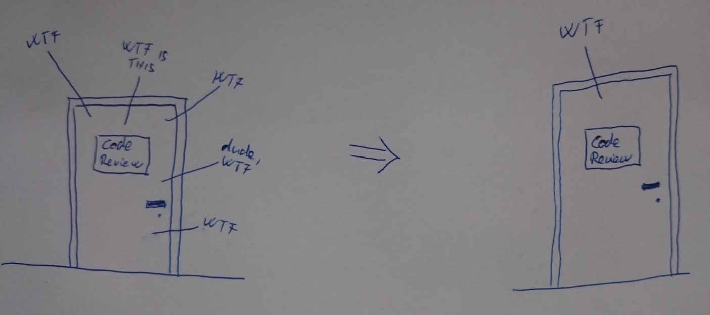

# eslint-plugin-shiwaforce

## Main concept, the idea behind the things below



We want to work with beautiful, nicely formatted code, so with the help of eslint we aim to enforce it - as much as we can. In an ideal world everybody would write such high quality code. Until we reach this state to standardise code formatting the eslint plugin can be a great help.

## Installation

```
npm install eslint eslint-plugin-shiwaforce --save-dev
```

## Usage

If you've installed eslint-plugin-shiwaforce locally within your project create the eslint.config.js file at the root of your node project.
(see details on the [eslint page](http://eslint.org/docs/user-guide/command-line-interface))

```js
import { defineConfig } from 'eslint/config';
import eslintPluginShiwaforce from './index.js';
export default defineConfig({
    extends: ['shiwaforce/client'],
	plugins: { shiwaforce: eslintPluginShiwaforce }
});

```
The plugin contains 3 different presets: base, client and server.

Run the linter by executing the command below:

```
npx eslint server/**/*.js
```

In case of a global installation the start the linter with...

```
eslint server/**/*.js
```

This command does NOT walk the entire dependency tree based on `require`-s or `import`-s, it only walks the file or files listed here. Of course, wild card characters can be used. For more information please visit the dedicated page at eslint ([cli docs](http://eslint.org/docs/user-guide/command-line-interface))

## Extending/Overriding the config

Add the `"rules"` key to your config then add your additional/override rules. For example, if you want to change the `"no-debugger"` and `"no-alert"` rules from default to your own add this:

```js
import { defineConfig } from 'eslint/config';
import eslintPluginShiwaforce from 'eslint-plugin-shiwaforce';
export default defineConfig([{
		extends: ['shiwaforce/server'],
		plugins: { shiwaforce: eslintPluginShiwaforce }
	},
	{
			rules: {
				'no-debugger':'off',
				'no-alert':'off'
			}
	}
]);
```

## Additional information about rules
[Eslint](http://eslint.org)
